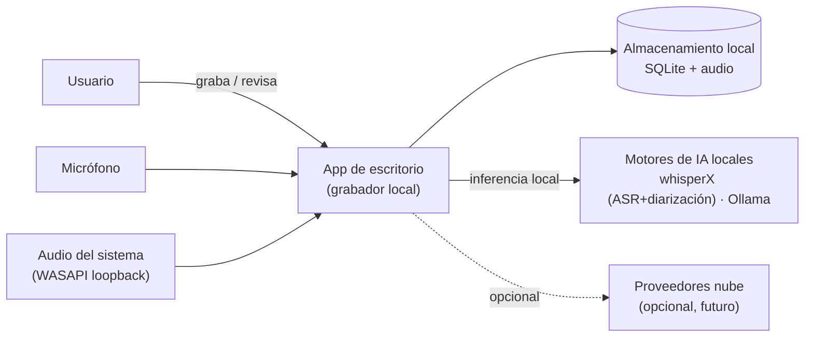
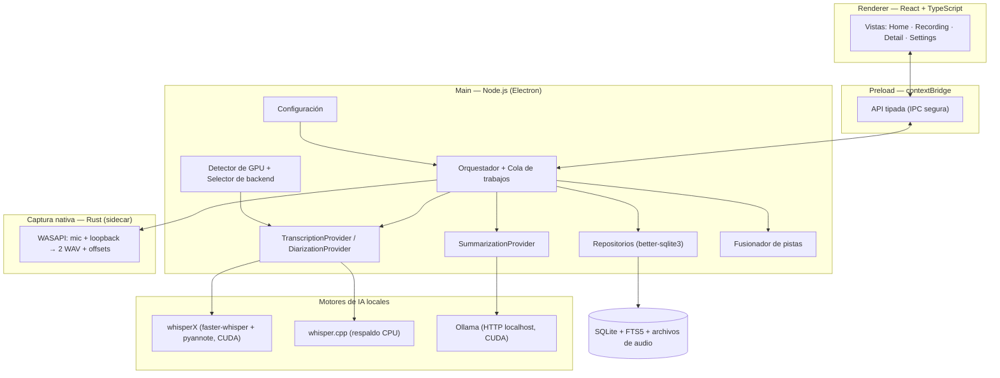
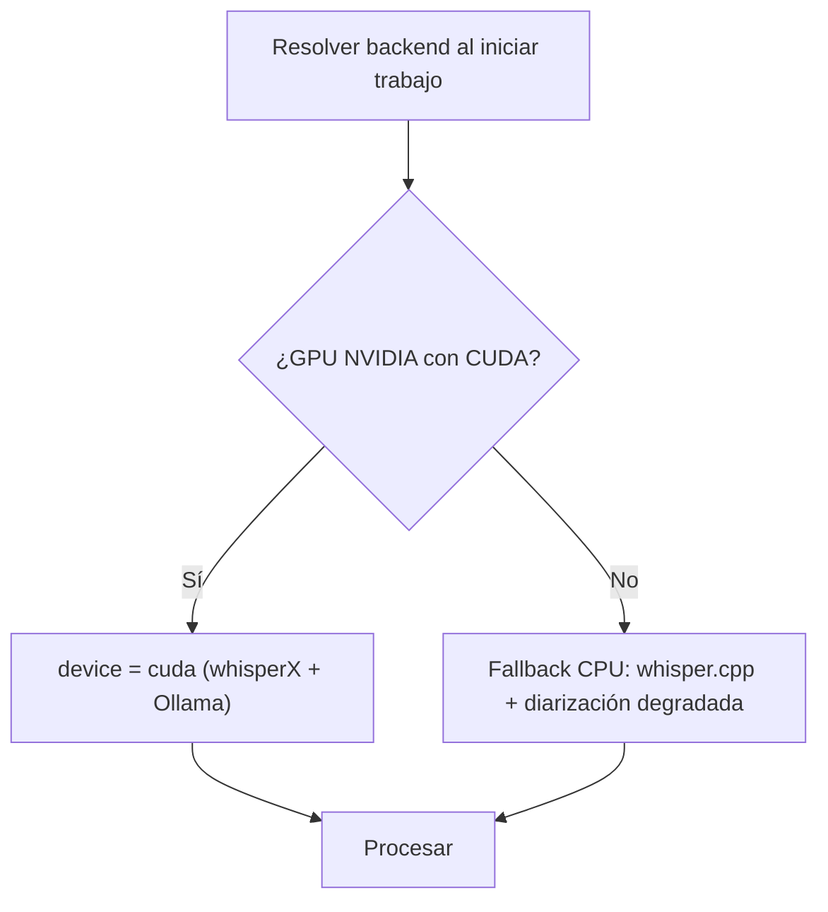
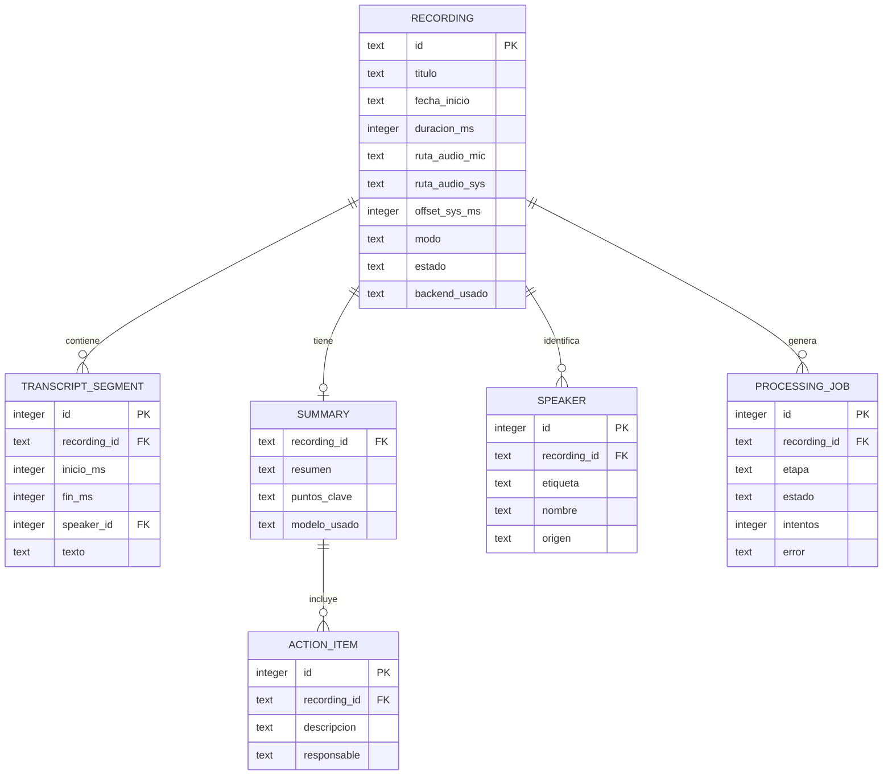
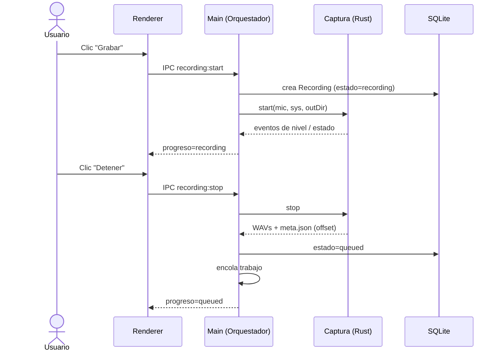
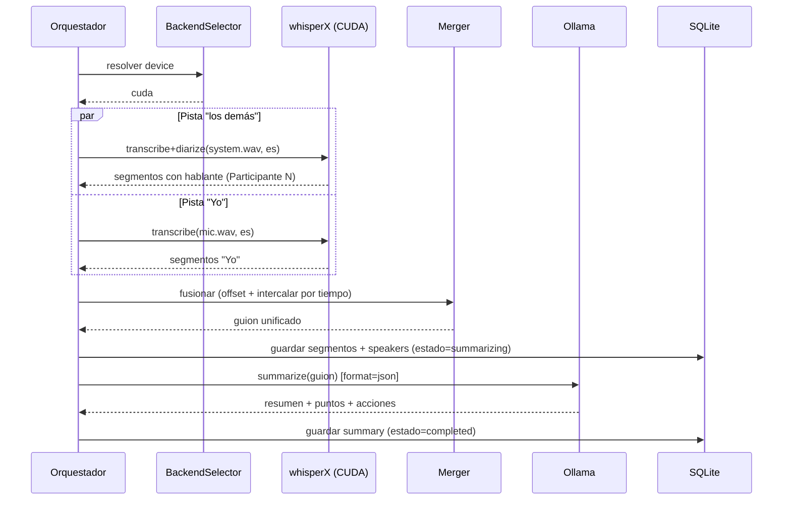
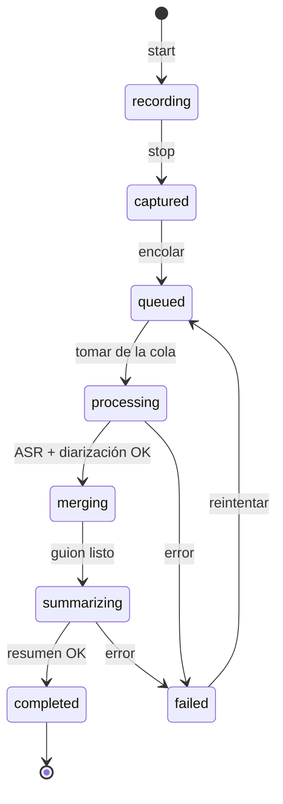

# Documento de Diseño de Software (SDD)
## Aplicación de grabación local de reuniones (solo audio) con transcripción, diarización y resumen

| Campo | Valor |
|---|---|
| Proyecto | Grabador local de reuniones (estilo tl;dv, 100% local) |
| Documento | Software Design Document (SDD), basado en IEEE 1016 |
| Versión | 0.2 (Borrador) — **MVP NVIDIA-only** |
| Fecha | 24 de junio de 2026 |
| Autor | Equipo de ingeniería · Fundación Ciudad de Paz |
| Documento base | Plan Técnico — Grabación local de reuniones (con diarización + multi-GPU) |
| Cambios v0.1→v0.2 | Alcance del MVP fijado a **NVIDIA (CUDA)**; ASR+diarización vía **whisperX**; AMD movido a trabajo futuro |
| Estado | Para revisión de ingeniería antes de iniciar la implementación |

---

## Índice

1. Introducción
2. Visión general del sistema
3. Consideraciones de diseño
4. Correcciones y refinamientos respecto al Plan Técnico
5. Arquitectura del sistema
6. Estrategia de IA y motores
7. Estrategia de GPU (NVIDIA ahora, AMD después)
8. Diseño de datos
9. Diseño detallado de componentes
10. Diseño de interfaces
11. Comportamiento dinámico (flujos)
12. Manejo de errores, logging y resiliencia
13. Seguridad y privacidad
14. Empaquetado y despliegue
15. Estrategia de pruebas
16. Estructura del proyecto
17. Trazabilidad de requisitos
18. Decisiones de arquitectura (ADR)
19. Trabajo futuro
20. Glosario

---

## 1. Introducción

### 1.1 Propósito

Este documento especifica el diseño de software de una aplicación de escritorio que **graba reuniones localmente (solo audio), las transcribe, identifica a los participantes (diarización) y genera resúmenes con IA**, sin que ningún dato salga del computador del usuario. Sirve como contrato técnico para el equipo de desarrollo: define arquitectura, componentes, interfaces, modelo de datos y flujos para empezar a programar el MVP.

### 1.2 Alcance

Un **equivalente local y privado a tl;dv**, para Windows, sin video y sin bots. Captura el audio en el equipo (micrófono + audio del sistema), procesa con motores de IA locales y guarda los resultados en una base de datos local. El **MVP se ejecuta sobre GPU NVIDIA (CUDA)**, con respaldo en CPU; el soporte AMD se difiere (sección 7 y 19) y el diseño lo deja como una extensión aditiva, no una reescritura.

### 1.3 Audiencia

Ingenieros (frontend, backend/Electron, ML), QA y responsables técnicos. Se asume familiaridad con TypeScript/Node, Python y conceptos básicos de ASR/diarización.

### 1.4 Definiciones y acrónimos

| Término | Definición |
|---|---|
| ASR | Automatic Speech Recognition (transcripción de voz a texto) |
| Diarización | Determinar "quién habló y cuándo" |
| whisperX | Pipeline que combina ASR (faster-whisper) + alineación a nivel de palabra + diarización (pyannote) |
| DER / WER | Métricas de error de diarización / transcripción |
| WASAPI | Windows Audio Session API |
| Loopback | Captura de lo que el sistema reproduce (voz de los demás) |
| Pista "Yo" / "los demás" | Audio del micrófono / del sistema |
| Sidecar | Proceso auxiliar orquestado por la app (whisperX, Ollama) |
| IPC | Comunicación entre procesos main↔renderer de Electron |
| LLM | Large Language Model (resúmenes y action items) |
| FTS5 | Full-Text Search v5 de SQLite |

### 1.5 Referencias

Plan Técnico del proyecto; whisperX (faster-whisper + pyannote), pyannote.audio (`community-1`/`3.1`), Ollama, Electron, better-sqlite3, SQLite FTS5.

---

## 2. Visión general del sistema

### 2.1 Objetivo

Que el usuario grabe una reunión en línea con un clic y obtenga automáticamente: la grabación de audio, una transcripción en español con hablantes identificados, y un resumen con puntos clave y tareas — todo procesado y almacenado localmente.

### 2.2 Características principales (MVP)

- Grabación de **dos pistas separadas**: micrófono ("Yo") y audio del sistema ("los demás").
- Transcripción local en español con marcas de tiempo.
- **Diarización por participante** desde el día 1 (vía whisperX).
- Resumen, puntos clave y action items con un LLM local.
- Biblioteca de grabaciones, reproductor con transcripción sincronizada y **búsqueda de texto**.
- **100% local**; arquitectura preparada para añadir nube y AMD como extensiones.

### 2.3 Diagrama de contexto



---

## 3. Consideraciones de diseño

### 3.1 Supuestos

- El usuario participa en reuniones **en línea**; la voz de los demás sale por el sistema (capturable por loopback).
- Hay micrófono y salida de audio identificables en Windows.
- El equipo del MVP tiene una **GPU NVIDIA con CUDA**. Sin GPU, se usa el respaldo en CPU (más lento, con diarización opcional).

### 3.2 Restricciones

- **Plataforma:** Windows 10/11.
- **Privacidad:** por defecto nada sale del equipo; la nube sería explícita y opcional.
- **Solo audio:** sin captura ni almacenamiento de video.
- **GPU del MVP:** NVIDIA (CUDA). AMD diferido.

### 3.3 Atributos de calidad priorizados

1. **Privacidad** (máxima).
2. **Robustez** del pipeline (no perder grabaciones; reanudable).
3. **Usabilidad** (instalador único + asistente de primer arranque).
4. **Mantenibilidad** (motores intercambiables tras interfaces → habilita nube y AMD a futuro).
5. **Rendimiento** (procesamiento en segundo plano; UI no se bloquea).

### 3.4 Casos límite considerados desde el diseño

- **Reunión presencial** (no en línea): la pista del sistema está en silencio; la diarización se aplica entonces a la **pista del micrófono** (ver 9.4, "modo presencial").
- **Uso de parlantes** (no audífonos): el micrófono capta a los demás (eco/bleed), contaminando la pista "Yo".
- **Solapamientos** (varios hablando a la vez): el caso más difícil para diarizar.
- **Cambio de dispositivo** de audio durante la grabación.
- **Desalineación temporal** entre las dos pistas si no comparten reloj.

---

## 4. Correcciones y refinamientos respecto al Plan Técnico

> Esta sección documenta dónde este SDD **corrige o ajusta** el Plan Técnico tras la revisión de ingeniería.

1. **Alcance del MVP fijado a NVIDIA (CUDA).** Esto habilita usar **whisperX** (faster-whisper + alineación + pyannote) como **motor integrado primario** de ASR y diarización en una sola pasada, simplificando el pipeline.
2. **Por qué se difiere AMD:** el backend de faster-whisper/whisperX es **CTranslate2, que oficialmente solo soporta CUDA y CPU (no ROCm)**. En AMD habría que usar otra ruta (whisper.cpp/Vulkan para ASR + pyannote en WSL2+ROCm para diarización) y un segundo entorno de ejecución. Es viable, pero añade complejidad y se posterga (sección 7.3 y 19).
3. **Diarización con pyannote `community-1`** (mejor que 3.1; DER ~11), usada **a través de whisperX**. 3.1 como fallback.
4. **La captura de dos pistas requiere alineación por reloj común:** no es "gratis"; ambas pistas comparten un reloj monotónico y registran su offset relativo. Un módulo de captura nativo único gestiona ambos endpoints.
5. **Distinción explícita reunión en línea vs presencial** (el truco "Yo vs los demás" aplica a reuniones en línea).
6. **Recomendación de LLM actualizada a 2026:** **Qwen3** (multilingüe + salida estructurada) como primario, **Gemma 3 12B** como alternativa liviana, en vez de Llama 3.1 8B / Qwen2.5.
7. **whisper.cpp** (lo que ya tienes) se conserva como **motor de respaldo en CPU** y para pruebas rápidas.

---

## 5. Arquitectura del sistema

### 5.1 Estilo arquitectónico

Aplicación de escritorio **Electron** con separación estricta de procesos y **motores de IA como sidecars** orquestados desde el proceso principal. La lógica de negocio (orquestación, persistencia, proveedores) vive en `main` (Node.js); la UI en `renderer` (React + TypeScript); la captura de audio es un **binario nativo en Rust**; y la inferencia ocurre en procesos externos (**whisperX**, Ollama).

**Justificación (ADR-1):** Electron maximiza velocidad de desarrollo, ecosistema y orquestación de binarios/sidecars (central aquí). El componente de audio, crítico en latencia y acceso a WASAPI, se aísla en Rust. Tauri es la alternativa más liviana evaluada en ADR-1.

### 5.2 Diagrama de arquitectura (vista de componentes)



### 5.3 Vista de procesos

| Proceso | Lenguaje | Responsabilidad |
|---|---|---|
| `main` | Node.js / TS | Orquestación, cola, persistencia, proveedores, IPC, ciclo de vida de sidecars |
| `renderer` | React / TS | UI; sin acceso directo a disco ni a Node |
| `preload` | TS | Puente seguro (contextBridge) con API tipada |
| Captura | Rust | Captura WASAPI de dos pistas con reloj común; escribe WAV + metadatos |
| whisperX | Python (CUDA) | ASR + alineación + diarización; worker persistente (socket local) o por trabajo |
| whisper.cpp | C/C++ (binario) | ASR de respaldo en CPU |
| Ollama | servicio | Servidor LLM local (HTTP `localhost:11434`) |

### 5.4 Comunicación

- **renderer ↔ main:** IPC de Electron sobre canales tipados (`shared/`), con `contextIsolation` activado.
- **main ↔ captura (Rust):** proceso hijo; control por stdin/stdout (`start`/`stop`) y eventos JSON.
- **main ↔ whisperX:** worker Python (CUDA) por **socket TCP local** (JSON); o invocación por trabajo.
- **main ↔ whisper.cpp:** proceso hijo (solo fallback CPU).
- **main ↔ Ollama:** HTTP REST local.

---

## 6. Estrategia de IA y motores

> El usuario pidió recomendar bien la IA. Aquí se fijan modelos y motores con justificación. Todo es intercambiable vía interfaces de proveedor (sección 9).

### 6.1 Transcripción + diarización (motor integrado)

- **Motor primario: whisperX** sobre **CUDA** — hace ASR (faster-whisper), alineación a nivel de palabra y diarización (pyannote) en un solo pipeline. Ideal para la pista "los demás".
- **Modelo ASR:** `large-v3` (máxima calidad en español) o `large-v3-turbo` (más rápido, poca pérdida); idioma forzado `es`.
- **Modelo de diarización:** `pyannote/speaker-diarization-community-1` (primario) o `3.1` (fallback), usado por whisperX. Requiere token gratuito de Hugging Face + aceptar términos (una vez).
- **Respaldo CPU: whisper.cpp** (sin GPU); en ese modo la diarización es opcional/degradada.

### 6.2 Resúmenes (LLM)

- **Motor: Ollama** (CUDA), HTTP local.
- **Modelo primario: Qwen3** (familia 2026; multilingüe fuerte y *structured output* estable — ideal para emitir JSON con resumen, puntos y tareas). Tamaño según VRAM: variante ~14B en **Q4_K_M** para ~16 GB; en 24 GB+ se puede subir a Qwen3 32B.
- **Alternativa liviana: Gemma 3 12B.**
- **Salida estructurada:** el prompt pide JSON `{ resumen, puntos_clave[], action_items[] }`; para transcripciones largas, *chunking* + resumen jerárquico.

### 6.3 Resumen de la pila de IA (MVP)

| Tarea | Motor | Modelo | GPU (NVIDIA) | Fallback CPU |
|---|---|---|---|---|
| ASR + diarización | whisperX | large-v3 + pyannote community-1 | CUDA | whisper.cpp (ASR) + diarización degradada |
| Resumen | Ollama | Qwen3 / Gemma 3 12B | CUDA | CPU (lento) |

---

## 7. Estrategia de GPU (NVIDIA ahora, AMD después)

### 7.1 MVP: NVIDIA (CUDA) con respaldo CPU

Todo corre **nativo en Windows**, un solo entorno. El `BackendSelector` resuelve el `device`:



### 7.2 Diseño preparado para multi-fabricante

La selección de hardware vive **detrás de las interfaces de proveedor**: el orquestador pide "transcribe/diariza esta pista" y el `BackendSelector` decide la implementación y el `device`. Por eso añadir AMD más adelante es **aditivo** (una nueva implementación de proveedor), sin tocar el resto de la app.

### 7.3 AMD (diferido)

Cuando se quiera soportar AMD: ASR con **whisper.cpp/Vulkan** (nativo) + diarización con **pyannote en WSL2 + ROCm**, con el orquestador haciendo de puente Windows↔WSL2. Se difiere por la complejidad del doble entorno y porque CTranslate2 (whisperX) no acelera en ROCm oficialmente. Detalle en la sección 19.

---

## 8. Diseño de datos

### 8.1 Modelo entidad-relación



### 8.2 Esquema SQLite (resumen)

- `recordings(id, titulo, fecha_inicio, duracion_ms, ruta_audio_mic, ruta_audio_sys, offset_sys_ms, modo, estado, backend_usado)`
- `speakers(id, recording_id, etiqueta, nombre, origen)` — `etiqueta` = `SPEAKER_00`…; `nombre` editable; `origen` = `mic|diar`.
- `transcript_segments(id, recording_id, inicio_ms, fin_ms, speaker_id, texto)`
- `summaries(recording_id, resumen, puntos_clave, modelo_usado)`
- `action_items(id, recording_id, descripcion, responsable)`
- `processing_jobs(id, recording_id, etapa, estado, intentos, error)`
- **Índices:** por `recording_id` en tablas hijas; por `estado` en `recordings` y `processing_jobs`.
- **Búsqueda:** tabla virtual **FTS5** `transcript_fts(texto, content='transcript_segments')`, sincronizada por triggers (FR-11).

### 8.3 Organización de archivos en disco

```
%APPDATA%/grabador-reuniones/
├─ data.db                 # SQLite (incluye FTS5)
├─ recordings/<id>/
│  ├─ mic.wav              # pista "Yo" (PCM 16 kHz mono)
│  ├─ system.wav           # pista "los demás"
│  └─ meta.json            # offsets, dispositivos, versión de captura
├─ models/                 # modelos (whisper / whisperX)
└─ logs/
```

### 8.4 Contratos de datos (TypeScript, en `shared/`)

```ts
type RecordingStatus =
  | 'recording' | 'captured' | 'queued'
  | 'processing' | 'merging' | 'summarizing'
  | 'completed' | 'failed';

interface TranscriptSegment {
  inicioMs: number;
  finMs: number;
  speaker: string;   // "Yo" | "Participante 1" | nombre real
  texto: string;
}

interface MeetingSummary {
  resumen: string;
  puntosClave: string[];
  actionItems: { descripcion: string; responsable?: string }[];
  modeloUsado: string;
}
```

---

## 9. Diseño detallado de componentes

> Patrón transversal: cada motor de IA se accede mediante una **interfaz de proveedor**, lo que permite intercambiar local↔nube y CUDA↔(AMD/CPU) sin tocar el orquestador.

### 9.1 Captura de audio (Rust, nativo)

- **Responsabilidad:** abrir el micrófono (WASAPI) y el endpoint de loopback del sistema, capturar **dos pistas** sincronizadas contra un **reloj monotónico común** (QueryPerformanceCounter) y escribir `mic.wav`, `system.wav` (PCM 16 kHz mono) y `meta.json` con offset y dispositivos.
- **Control (stdio):** `start {micId, sysId, outDir}`, `stop`; eventos `level`, `state`, `error`.
- **Decisiones:** resampleo a 16 kHz en captura; manejo de reconexión de dispositivo; supresión opcional de ruido/eco (RNNoise/WebRTC AEC).

### 9.2 Orquestador y cola (`main`)

- Máquina de estados por grabación (11.3), cola persistente (`processing_jobs`), un trabajo a la vez por defecto, reanudación tras reinicio y publicación de progreso al renderer.

### 9.3 TranscriptionProvider / DiarizationProvider

```ts
interface TranscriptionProvider {
  transcribe(track: AudioTrackRef, opts: { lang: 'es'; model: string; device: Device })
    : Promise<TranscriptSegment[]>;
}
interface DiarizationProvider {
  diarize(track: AudioTrackRef, opts: { device: Device; minSpeakers?: number; maxSpeakers?: number })
    : Promise<{ inicioMs: number; finMs: number; speaker: string }[]>;
}
```

- **`WhisperXProvider`** (primario, CUDA) implementa **ambas** en una sola pasada para la pista del sistema (transcribe + alinea + diariza), devolviendo segmentos ya etiquetados por hablante.
- **`WhisperCppProvider`** (fallback CPU) implementa solo `transcribe`.
- Futuras (aditivas): `DeepgramProvider`/`AssemblyAIProvider` (nube); ruta AMD (whisper.cpp/Vulkan + pyannote/ROCm).

### 9.4 Fusionador de pistas (TrackMerger)

- **Entrada:** segmentos de la pista "Yo" (todos hablante "Yo") + segmentos ya diarizados de la pista del sistema (de whisperX) + `offset_sys_ms`.
- **Algoritmo:** desplazar los tiempos de la pista del sistema según el offset y **intercalar por tiempo** ambos flujos en un único guion ordenado. (Con whisperX la asignación de hablante dentro del sistema ya viene resuelta; en modo fallback sin diarización, todo "los demás" queda como un único hablante genérico.)
- **Modo presencial:** si `recording.modo === 'presencial'`, se diariza la pista del micrófono y no se usa la del sistema.

### 9.5 SummarizationProvider

```ts
interface SummarizationProvider {
  summarize(transcript: TranscriptSegment[], opts: { model: string })
    : Promise<MeetingSummary>;
}
```

- **`OllamaProvider`** (HTTP local, `format: json`). Futuras: `ClaudeProvider`, `OpenAIProvider`.

### 9.6 Persistencia (Repository)

- `RecordingRepository`, `TranscriptRepository`, `SummaryRepository`, `JobRepository` sobre **better-sqlite3** (síncrono, ideal en main); mantiene sincronizada la tabla FTS5.

### 9.7 HardwareDetector + BackendSelector

- Detecta GPU NVIDIA/CUDA (en Windows, `win32_VideoController` vía WMI o un probe `nvidia-smi`); devuelve `device` (`cuda`|`cpu`) y la implementación de proveedor. Cachea el resultado y lo muestra en Ajustes.

### 9.8 Configuración (Settings)

- Modelos (whisper/LLM), dispositivos de audio, carpeta de datos, modo (online/presencial), backend (auto/forzado), token de Hugging Face (almacén seguro), conmutador local/nube (futuro).

### 9.9 Capa de UI (React)

- Componentes por vista (10.3); estado vía hooks; toda interacción con el sistema pasa por la API del `preload`.

---

## 10. Diseño de interfaces

### 10.1 Interfaces internas (IPC)

| Canal | Dirección | Payload | Respuesta/Evento |
|---|---|---|---|
| `recording:start` | renderer→main | `{ titulo?, modo }` | `{ id }` |
| `recording:stop` | renderer→main | `{ id }` | `{ ok }` |
| `recordings:list` | renderer→main | `{ filtro? }` | `Recording[]` |
| `recording:get` | renderer→main | `{ id }` | `RecordingDetail` |
| `transcript:search` | renderer→main | `{ id, query }` | `Segment[]` (FTS5) |
| `speaker:rename` | renderer→main | `{ recordingId, speakerId, nombre }` | `{ ok }` |
| `processing:progress` | main→renderer | `{ id, etapa, estado }` | evento |
| `settings:get/set` | renderer→main | `{...}` | `Settings` |

### 10.2 Interfaces con sidecars

- **whisperX worker:** petición JSON `{ audioPath, lang:'es', model, device:'cuda', diarize:true, minSpeakers?, maxSpeakers?, hfToken }` → respuesta `{ segments: [{startMs, endMs, speaker, text}] }`, por socket TCP local.
- **whisper.cpp (fallback):** `whisper-cli -m <modelo> -l es -f <wav> -oj` → JSON de segmentos.
- **Ollama:** `POST /api/chat` con prompt y `format: json` → JSON del resumen.

### 10.3 Interfaz de usuario (vistas)

- **Home:** lista de grabaciones (título, fecha, duración, estado) + botón "Grabar".
- **Recording:** temporizador, medidores de nivel (mic y sistema), selección de dispositivos, modo online/presencial, botón "Detener".
- **Detail:** reproductor + transcripción sincronizada (clic en línea salta al audio), hablantes renombrables, resumen, puntos clave, action items y buscador.
- **Settings:** modelos, dispositivos, backend GPU, token HF, carpeta de datos.

---

## 11. Comportamiento dinámico (flujos)

### 11.1 Secuencia: grabar una reunión



### 11.2 Secuencia: procesamiento post-reunión (NVIDIA)



### 11.3 Máquina de estados de una grabación



---

## 12. Manejo de errores, logging y resiliencia

- **Sin pérdida de audio:** los WAV se escriben en streaming; si el procesamiento falla, la grabación queda en `failed` con detalle y es **reintentable** desde la cola.
- **Reanudación:** al arrancar, el orquestador retoma trabajos `queued`/`processing` interrumpidos.
- **Sidecars:** timeouts, reintentos con backoff, detección de caída; si no hay CUDA, se degrada a CPU (transcripción sin diarización fina), marcando el resultado.
- **Logging:** local, rotado, en `logs/`; niveles configurables; sin red.

---

## 13. Seguridad y privacidad

- **Local por defecto:** grabaciones, transcripciones y resúmenes permanecen en el equipo. Sin llamadas de red salvo activación explícita de nube (futuro).
- **Datos en reposo:** carpeta del usuario; **cifrado opcional** de la base (SQLCipher) y/o de audios.
- **Secretos:** token de Hugging Face y futuras API keys con `safeStorage` de Electron (almacén del SO), nunca en texto plano.
- **Aislamiento del renderer:** `contextIsolation` activo, sin `nodeIntegration`.
- **Cumplimiento (Ley 21.719, Chile):** las grabaciones de voz son datos personales. La app debe facilitar **consentimiento** (aviso al iniciar), **retención/borrado** y control de acceso. *No es asesoría legal; validar con un abogado.*

---

## 14. Empaquetado y despliegue

- **Instalador único:** `electron-builder` → `.exe` para Windows.
- **Dependencias pesadas no empaquetadas:** modelos (whisper/whisperX, Ollama) y entorno Python se resuelven en el **primer arranque**.
- **Asistente de primer arranque:**
  1. Detecta GPU NVIDIA/CUDA (o decide fallback CPU).
  2. Prepara el entorno Python de whisperX (faster-whisper CUDA + pyannote) y las librerías CUDA/cuDNN necesarias.
  3. Descarga el modelo de whisper, el de Ollama (`ollama pull`) y configura el token de Hugging Face.
- **Actualizaciones:** auto-update de Electron; modelos versionados aparte.

---

## 15. Estrategia de pruebas

| Nivel | Herramienta | Alcance |
|---|---|---|
| Unitarias | Vitest | Merger, repositorios, BackendSelector, parsers de salida de sidecars |
| Integración | Vitest + audio "golden" | Contrato con whisperX (entrada/salida real) |
| E2E | Playwright + Electron | Flujos grabar→procesar→ver, búsqueda, renombrar hablantes |
| Hardware | Manual/CI | NVIDIA (CUDA) y fallback CPU |
| Calidad IA | Scripts | **WER** del ASR y **DER** de la diarización sobre audio en español de prueba |

**Criterios de aceptación del MVP:** grabar y procesar una reunión en línea en español, con transcripción legible, separación correcta "Yo vs participantes", resumen con puntos y tareas, y búsqueda funcionando — en una máquina NVIDIA.

---

## 16. Estructura del proyecto

```
grabador-reuniones/
├─ package.json
├─ electron-builder.yml
├─ tsconfig.json
├─ src/
│  ├─ main/
│  │  ├─ index.ts
│  │  ├─ orchestrator.ts
│  │  ├─ queue.ts
│  │  ├─ ipc/
│  │  ├─ providers/
│  │  │  ├─ transcription/   # whisperX.ts, whisperCpp.ts
│  │  │  └─ summarization/   # ollama.ts
│  │  ├─ hardware/           # detect.ts, backendSelector.ts
│  │  ├─ persistence/        # repos + migraciones SQLite/FTS5
│  │  └─ capture/            # binding al binario Rust
│  ├─ preload/index.ts
│  ├─ renderer/             # React + TS (pages/, components/)
│  └─ shared/               # tipos y contratos IPC
├─ native/                  # captura WASAPI en Rust → binario
├─ python/                  # worker whisperX (worker.py, requirements.txt)
└─ resources/               # modelos y binarios empaquetados
```

**Convenciones:** TypeScript estricto; ESLint + Prettier; commits convencionales; lógica de negocio sin dependencias de Electron para facilitar pruebas.

---

## 17. Trazabilidad de requisitos

| ID | Requisito | Componentes |
|---|---|---|
| FR-1 | Capturar mic + sistema en 2 pistas | Captura (Rust) |
| FR-2 | Iniciar/detener grabación | UI, Orquestador, Captura |
| FR-3 | Almacenar grabación local | Persistencia, FS |
| FR-4 | Transcribir en español | TranscriptionProvider (whisperX) |
| FR-5 | Diarizar participantes | whisperX (pyannote) |
| FR-6 | Etiquetar "Yo" | Merger (pista mic) |
| FR-7 | Guion con hablantes + tiempos | Merger, Persistencia |
| FR-8 | Resumen + puntos + tareas | SummarizationProvider (Ollama) |
| FR-9 | Listar grabaciones | UI (Home), Repos |
| FR-10 | Reproducir + transcripción sincronizada | UI (Detail) |
| FR-11 | Buscar texto | SQLite FTS5 |
| FR-12 | Configuración | Settings |
| FR-13 | Detección de GPU + backend | HardwareDetector, BackendSelector |
| NFR-1 | Privacidad 100% local | Arquitectura, Seguridad |
| NFR-2 | NVIDIA + fallback CPU (multi-fabricante a futuro) | Estrategia de GPU, Proveedores |
| NFR-3 | Procesamiento en segundo plano | Orquestador/Cola |
| NFR-4 | Instalador único + asistente | Empaquetado |
| NFR-5 | Mantenibilidad (proveedores) | Interfaces de proveedor |

---

## 18. Decisiones de arquitectura (ADR)

- **ADR-1 — Electron + React + TypeScript.** Velocidad, ecosistema y orquestación de sidecars. Alternativa Tauri (binarios menores, WASAPI en Rust nativo); se reevaluará si tamaño/consumo se vuelve crítico.
- **ADR-2 — MVP NVIDIA-only con whisperX integrado.** CUDA permite usar whisperX (ASR+alineación+diarización en un paso), simplificando el pipeline. AMD se difiere (CTranslate2 es CUDA-only).
- **ADR-3 — Diarización con pyannote `community-1` vía whisperX.**
- **ADR-4 — Dos pistas con reloj común.** Captura nativa única que alinea mic y sistema y registra offsets.
- **ADR-5 — LLM local vía Ollama (Qwen3 / Gemma 3) tras interfaz de proveedor.** Multilingüe + salida estructurada; puerta abierta a nube.
- **ADR-6 — SQLite + FTS5.** Persistencia y búsqueda local sin servidor.
- **ADR-7 — Setup en primer arranque, no bundling.** Instalador pequeño y adaptativo.
- **ADR-8 — whisper.cpp como fallback CPU.** Reutiliza lo existente y garantiza funcionamiento sin GPU.

---

## 19. Trabajo futuro

- **Soporte AMD (ROCm):** ASR con whisper.cpp/Vulkan (nativo) + diarización con pyannote en WSL2+ROCm; orquestador como puente. Aditivo gracias a las interfaces de proveedor.
- Transcripción y diarización **en vivo** (streaming).
- Asignar **nombres reales** a los hablantes (y memoria de voces entre reuniones).
- Highlights/clips y exportación (Markdown, PDF, SRT).
- Integración con calendario para auto-grabar.
- Proveedores en la nube activables (Deepgram/AssemblyAI, Claude/OpenAI).
- App para Mac/Linux.

---

## 20. Glosario

Ver sección 1.4. Términos clave: ASR, diarización, whisperX, DER/WER, WASAPI, loopback, sidecar, IPC, FTS5.
